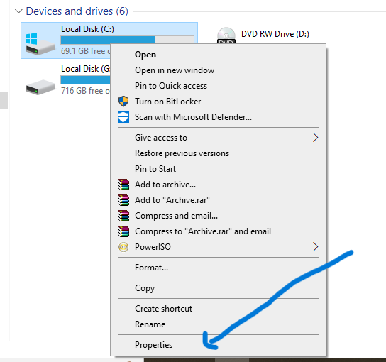

# NTFS Alternate Data Streams (ADS) – Hands-On Lab

##  Lab Overview

This lab demonstrates how **NTFS Alternate Data Streams (ADS)** work, how data can be hidden inside a file, and why this feature is relevant from a **cybersecurity perspective**.

ADS is a feature of the **NTFS file system** that allows a single file to contain **multiple data streams**, where only one stream is visible by default.

---

##  Learning Objectives

After completing this lab, you will be able to:

* Understand what a **stream** is in NTFS
* Create and verify **Alternate Data Streams**
* Understand how ADS can be abused by attackers
* Detect and remove ADS
* Understand ADS limitations and security implications

---

##  Prerequisites

* Windows OS
* NTFS file system
* Basic command line knowledge
* No malware required (safe lab)

---

## ⚠️ Important Notes

* ADS works **ONLY on NTFS**
* This lab is for **educational purposes only**
* Do NOT perform this on important system files

---

## 🧪 Lab Environment Setup

1. Create a test folder:

```cmd
mkdir C:\ADS_Lab
cd C:\ADS_Lab
```

2. Verify file system:

* Right-click drive → Properties



* Ensure it shows **NTFS**


---

## 🧪 Step 1: Create a Normal File

```cmd
echo This is a normal file > normal.txt
```

Verify:

```cmd
type normal.txt
```

---

## 🧪 Step 2: Create an Alternate Data Stream (ADS)

Create a hidden stream inside the existing file:

```cmd
echo This is hidden ADS data > normal.txt:hidden.txt
```

👉 At this point:

* `normal.txt` still looks the same
* File size does NOT change
* Hidden data exists inside the file

---

## 🧪 Step 3: Verify ADS Exists

Use:

```cmd
dir /r
```

Expected output:

```
normal.txt
  normal.txt:hidden.txt:$DATA
```

This confirms the Alternate Data Stream exists.


---

## 🧪 Step 4: Read ADS Content

```cmd
notepad normal.txt:hidden.txt
```

You will see the hidden text stored in ADS.

---

## 🧪 Step 5: Demonstrate Executable in ADS (Safe Demo)

⚠️ This uses a **legitimate Windows executable**, not malware.

1. Copy Calculator:

```cmd
copy C:\Windows\System32\calc.exe .
```

2. Store it inside ADS:

```cmd
type calc.exe > normal.txt:calc.exe
```


3. Execute it:

```cmd
start normal.txt:calc.exe
```

Calculator opens even though no visible EXE file exists.

---

## Explanation (Behind the Scenes)

* NTFS stores files as **attributes**
* `$DATA` is the attribute that holds file content
* NTFS allows **multiple `$DATA` attributes**
* Explorer only shows the **default stream**
* Windows can execute **any valid stream** if referenced correctly

ADS hides **where data is stored**, not how it is executed.

---

## 🧪 Step 6: Detect ADS (Defender View)

### Using CMD:

```cmd
dir /r
```

### Using PowerShell:

```powershell
Get-Item normal.txt -Stream *
```

---

## 🧪 Step 7: Remove ADS

```powershell
Remove-Item normal.txt -Stream hidden.txt
Remove-Item normal.txt -Stream calc.exe
```

Verify removal:

```cmd
dir /r
```

---

## 🔐 Security Discussion

### Why ADS Exists (Legitimate Uses)

* File metadata storage
* Internet download tracking (`Zone.Identifier`)
* Compatibility features

### Why ADS Is Dangerous

* Hidden from Explorer
* Can store executables
* Abused for stealth by attackers

### Important Reality

* ADS **cannot infect a system by itself**
* Attacker must create or modify the file
* ADS is usually used **after compromise**

---

## ❌ ADS Limitations

* NTFS only
* Removed when copied to FAT/USB
* Stripped by email and cloud services
* Detected by modern antivirus and EDR

---

## Key Takeaways

* A **stream** is a sequence of bytes
* ADS is a **named data stream**
* ADS is hidden storage, not automatic execution
* ADS abuse requires attacker write access
* ADS is more educational than practical today

---

## 📚 Conclusion

Alternate Data Streams demonstrate how **file system design decisions** can be misused. While ADS is rarely used in modern attacks, it remains an important concept in **Windows internals, digital forensics, and cybersecurity education**.

---

## 🏷️ Tags

`NTFS` `ADS` `Windows Internals` `Cybersecurity` `Forensics` `Blue Team` `Red Team`
