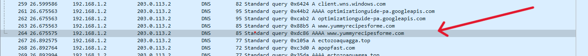

# DNS Failure Analysis Lab

In this hands-on lab, I simulated a network incident where users could not access a website due to a "destination port unreachable" error. Using Wireshark, I captured and analyzed traffic to identify that the **DNS service was unreachable**.

## 🔧 Tools Used
- Wireshark
- `nslookup`, `netsh`
- Windows Command Prompt

## 🧪 Objective
- Understand DNS and ICMP protocols
- Practice packet analysis
- Diagnose network connectivity issues

## 📊 Findings
- DNS query sent to `203.0.113.2` (fake server)
- No response received
- No ICMP "port unreachable" (likely filtered)
- Conclusion: **DNS service failure** prevented domain resolution

## 🖼️ Wireshark Capture
Below is the captured DNS query sent to the unreachable server `203.0.113.2`. No response was received, confirming the DNS service was down or misconfigured.

## 📚 Skills Demonstrated
- Network protocol analysis
- Cybersecurity troubleshooting
- Incident documentation

> This lab was part of my cybersecurity training to understand how network layer issues impact security and availability.