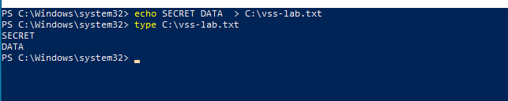
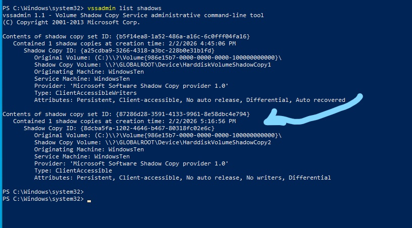
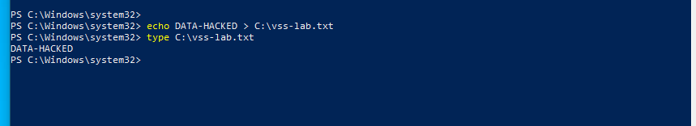
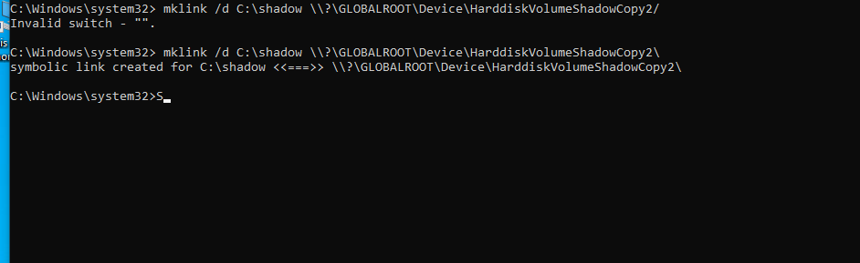
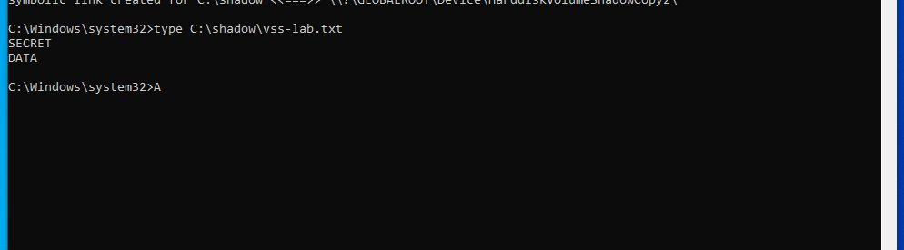
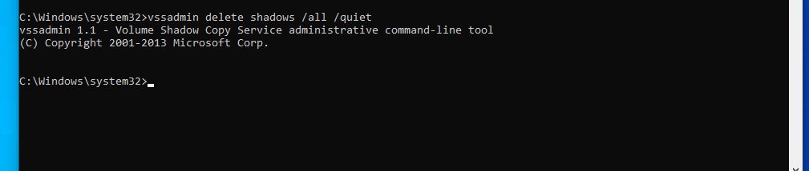

````markdown
# 🔐 Volume Shadow Copy Service (VSS) – Hands-On Security Lab

## 📌 Lab Overview
This lab demonstrates how **Volume Shadow Copy Service (VSS)** can be abused by attackers to access historical versions of files, and how ransomware commonly deletes shadow copies to prevent recovery.

The lab was performed in a **Windows 10 virtual machine** using **real-world attacker techniques**, not GUI-based restore points.

---

## 🎯 Learning Objectives
- Understand how VSS works
- Create shadow copies manually
- Access previous file versions using `GLOBALROOT`
- Simulate ransomware-like behavior
- Map techniques to MITRE ATT&CK

---

## 🧱 Lab Environment
- **Operating System:** Windows 10 (VM)
- **Access Level:** Local Administrator
- **Tools Used:**
  - `wmic`
  - `vssadmin`
  - `mklink`
  - `cmd.exe`

> ⚠️ This lab was conducted in an isolated virtual environment.

---

## 🧠 Key Concept
> **Restore Points ≠ VSS**
>
> Attackers do NOT rely on the “Previous Versions” GUI.  
> Instead, they directly interact with **Volume Shadow Copies**.

---

## 🧪 Lab Steps

### 1️⃣ Create a Test File
```cmd
echo ORIGINAL-DATA > C:\vss_lab.txt
type C:\vss_lab.txt
````



---

### 2️⃣ Create a Shadow Copy (Attacker Method)

```cmd
wmic shadowcopy call create Volume='C:\'
```

**Expected Output:**

```
Method execution successful.
ShadowID = "{GUID}"
```


---

### 3️⃣ Verify Shadow Copy Exists

```cmd
vssadmin list shadows
```

Look for:

```
\\?\GLOBALROOT\Device\HarddiskVolumeShadowCopyX
```


---

### 4️⃣ Modify the Original File

```cmd
echo MODIFIED-DATA > C:\vss_lab.txt
type C:\vss_lab.txt
```



---

### 5️⃣ Mount the Shadow Copy

> ⚠️ Must be executed in **Command Prompt (CMD)**, not PowerShell

```cmd
mklink /d C:\shadow \\?\GLOBALROOT\Device\HarddiskVolumeShadowCopyX\
```

**Expected Output:**

```
symbolic link created
```


---

### 6️⃣ Access the Old Version of the File

```cmd
type C:\shadow\vss_lab.txt
```

**Expected Output:**

```
SECRET-DATA
```

✅ This confirms recovery of the previous file version from the shadow copy.




---

### 7️⃣ Attacker Cleanup (Ransomware Behavior)

```cmd
vssadmin delete shadows /all /quiet
```

Verify deletion:

```cmd
vssadmin list shadows
```

**Expected Output:**

```
No shadow copies present
```


---

## 🧨 Attacker Perspective

Attackers abuse VSS to:

* Access locked system files (e.g., SAM, SYSTEM)
* Extract sensitive or historical data
* Delete backups to prevent recovery

### Common Commands Used by Ransomware:

```cmd
vssadmin delete shadows /all /quiet
wmic shadowcopy delete
```

---

## 🛡️ Defender Perspective

Defenders should monitor:

* `vssadmin.exe`
* `wmic.exe`
* `mklink.exe`
* Use of `GLOBALROOT`

### Relevant Windows Event:

* **Event ID 4688** – Process Creation

---

## 🧭 MITRE ATT&CK Mapping

| Technique               | ID     |
| ----------------------- | ------ |
| Inhibit System Recovery | T1490  |
| Defense Evasion         | TA0005 |
| Impact                  | TA0040 |

---

## 🧠 Key Takeaways

* VSS is a powerful recovery feature and a high-value attack target
* GUI restore points are not reliable for security analysis
* Direct shadow copy access reflects real-world attacker behavior
* Shadow copy deletion is a strong indicator of ransomware activity

---

## 📂 Project Structure

```
vss-lab/
│
├── README.md
├── images/
│   ├── step1-file-created.png
│   ├── step2-shadow-created.png
│   ├── step3-list-shadows.png
│   ├── step4-file-modified.png
│   ├── step5-shadow-mounted.png
│   ├── step6-old-file-recovered.png
│   └── step7-shadows-deleted.png
```

---

## 📚 References

* Microsoft VSS Documentation
* TryHackMe – Windows Internals & Ransomware Labs
* MITRE ATT&CK Framework

---

## ⚠️ Disclaimer

This project is for **educational purposes only**.
All activities were conducted in a controlled virtual lab environment.

```


